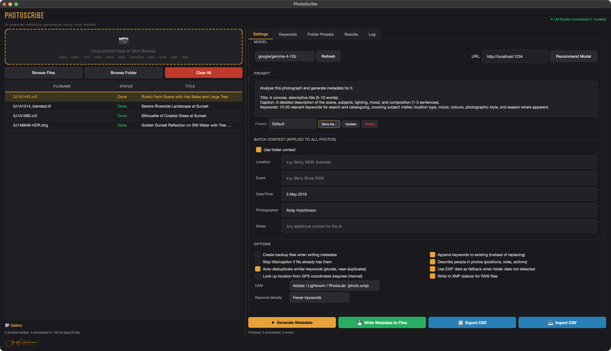
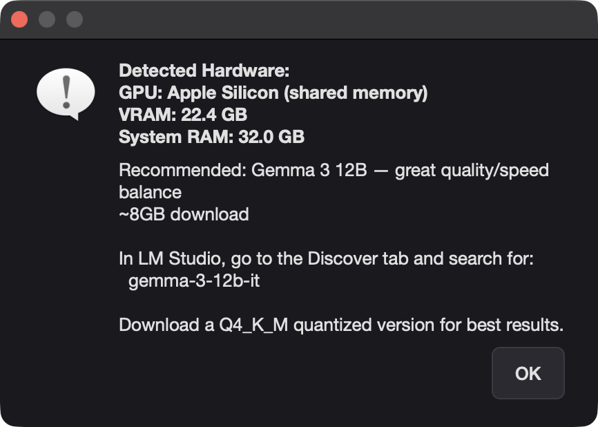
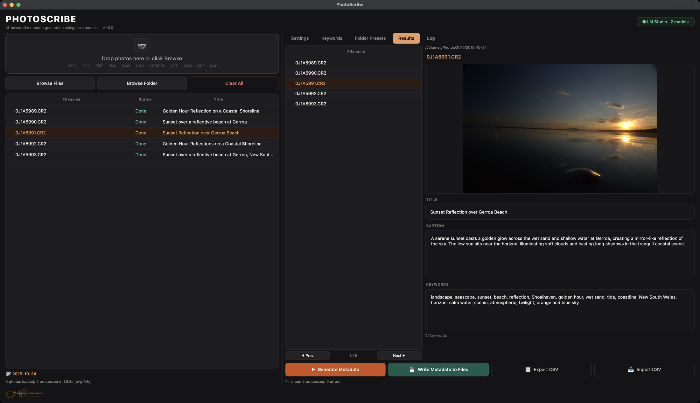

# PhotoScribe

AI-powered photo metadata generator that runs entirely on your Mac, Linux or Windows PC. Drop in your photos, generate title, caption, and keywords using a local AI model, review everything, then write it straight to your files as IPTC and XMP metadata.

**No cloud. No subscription. No data leaves your machine.**



---

## What you need

PhotoScribe requires two free pieces of software in addition to the app itself.

### 1. PhotoScribe

Grab the latest build from the **[releases page](https://github.com/repomonkey/PhotoScribe/releases/latest)**.

**macOS:** Download `PhotoScribe.dmg`, open it, and drag PhotoScribe to your Applications folder. That's it — no Python, no Terminal, no setup.

> **First launch only:** macOS will ask if you're sure you want to open it. Click Open. This is normal for any app downloaded outside the Mac App Store and won't happen again.

**Windows:** Download `PhotoScribe-Setup.exe`, run it, and follow the installer, then launch PhotoScribe from the Start menu. ExifTool is bundled in, so there's nothing else to install for writing metadata.

### 2. An AI backend — LM Studio or Ollama

PhotoScribe needs a local AI backend running on your computer. This is what actually looks at your photos and generates the descriptions and keywords. Two options are supported, both available for Mac and Windows:

---

**Option A: LM Studio** *(recommended — no Terminal required)*

[LM Studio](https://lmstudio.ai) is a polished app (Mac and Windows) for running local AI models. Download it from **[lmstudio.ai](https://lmstudio.ai)**, install it, then:

1. Open LM Studio and go to the **Discover** tab
2. Search for **gemma-3** and download a vision model — `gemma-3-12b` for best quality, `gemma-3-4b` for lighter machines
3. Go to the **Local Server** tab (the `<->` icon on the left) and click **Start Server**

In PhotoScribe's Settings tab, change the URL to `http://localhost:1234` and click Refresh.

---

**Option B: Ollama** *(lightweight, runs in the menu bar)*

Download from **[ollama.com/download](https://ollama.com/download)**. Once installed, open Terminal and pull a model:

```
ollama pull gemma3:12b    # best quality, ~8GB RAM
ollama pull gemma3:4b     # lighter, ~3GB RAM
```

Ollama uses `http://localhost:11434` (the PhotoScribe default). It starts automatically at login.

---

> **Which model?** On an M-series Mac with 16GB+ RAM, a 12b model gives noticeably better results. On 8GB machines, the 4b model is faster and still solid. The download is 3–8GB and only happens once — everything runs offline after that.

**Not sure which to pick?** Click **Recommend Model** (top-right of Settings). PhotoScribe detects your GPU/RAM and suggests the best Gemma model for your machine — with the exact name to search for in LM Studio, or a one-click pull for Ollama.



### 3. ExifTool — writes metadata to your files

ExifTool is a small, free utility that does the actual work of embedding metadata into your photo files. PhotoScribe uses it behind the scenes when you click "Write Metadata to Files."

**Windows:** Nothing to do — ExifTool is bundled inside the installer.

**macOS:** ExifTool isn't bundled, so install it once. If it's missing, PhotoScribe will tell you and offer a direct link — no Terminal required, the ExifTool website provides a standard macOS `.pkg` installer:

👉 **[Download ExifTool for macOS](https://exiftool.org/install.html)**

Download the macOS Package, open it, and follow the prompts. Done.

You can generate and export metadata without ExifTool, but you won't be able to write it directly to files.

---

## How to use PhotoScribe

### The basics

1. **Drop your photos** into the left panel, or use the Browse buttons
2. **Fill in the batch context** — location, event, date, photographer. The more context you give the AI, the better the results
3. **Pick your model** in the Settings tab (PhotoScribe auto-detects what's available in LM Studio or Ollama)
4. **Click Generate Metadata** — the AI works through each photo one by one
5. **Review everything** in the Results tab. You can edit titles, captions, and keywords directly before writing
6. **Click Write Metadata to Files** when you're happy

You can also **Export CSV** to review or bulk-edit a whole batch in a spreadsheet, then **Import CSV** to load your edits back in. Double-click any processed photo in the list to jump straight to its entry in the Results tab.



### Supported formats

**Standard:** JPEG, HEIC/HEIF (iPhone photos), TIFF, PNG, WebP

**RAW:** CR2, CR3 (Canon), NEF (Nikon), ARW (Sony), ORF (Olympus/OM System), RAF (Fujifilm), RW2 (Panasonic), PEF (Pentax), DNG, and more

### Where does the metadata go?

PhotoScribe writes to both IPTC and embedded XMP, which means it works with every major cataloguing application: **Lightroom Classic, Capture One, Photo Mechanic, Bridge, Finder,** and anything else that reads standard metadata.

**RAW files — XMP sidecars.** For RAW formats, enable *"Write to XMP sidecar for RAW files"* in Options and pick the naming convention your software expects:

- **Adobe / Lightroom / PhotoLab** — `photo.xmp` (extension replaced). Use for Lightroom Classic, Bridge, and **DxO PhotoLab**.
- **Darktable / DigiKam** — `photo.cr2.xmp` (extension kept). Use for darktable, digiKam, and similar DAM tools.

> **DxO PhotoLab users:** turn on *Preferences → "Synchronize metadata with XMP sidecars"* so PhotoLab reads the sidecar. Then, to pull in metadata PhotoScribe has written, select the photo(s) and choose **File → Metadata → Read Metadata From Image** — the title, description, and keywords will appear. PhotoLab scatters the standard IPTC fields across several panel sections rather than grouping them, so they're not all in one place: **Description** sits under *IPTC - Content*, **Title** under *IPTC - Status*, and keywords in the *Keywords* panel. It's all there — just spread around.

---

## Settings and options

### Batch context

Fill in Location, Event, Date/Time, and any notes before you process. The AI uses this to produce much more accurate and relevant results. For a landscape shoot, put the location. For an event, describe what it was. The difference in quality is significant.

### Folder context detection

Tick **Use folder context** and PhotoScribe reads your folder names to pre-fill the batch context. Dated names like `20250315 - Berry NSW` or `2025-03-15 Berry NSW` (and dot-separated variants) are parsed into Location and Date/Time — it walks up the directory tree, so nested folders still inherit the parent's context. It only fills fields you've left empty, so your manual input is never overwritten.

- **Use EXIF date as fallback** — when no date is in the folder name, reads `DateTimeOriginal` from the photo instead.
- **Look up location from GPS coordinates** *(opt-in, off by default)* — if a photo has GPS data, looks up a place name via OpenStreetMap. Because this sends coordinates to an external service, the first time you enable it PhotoScribe asks you to confirm. Everything else stays on your machine.

### Folder presets

In the **Folder Presets** tab you can define rules: *if a folder name contains X, auto-apply a prompt preset or a keyword list.* Useful for recurring subjects — e.g. a folder containing "wedding" applies your Event preset and wedding vocabulary automatically. First matching rule wins.

### Prompts and presets

The default prompt works well for most photography, with built-in presets for Landscape, Event, and Product. Edit the prompt freely, then manage your own presets from the dropdown — **Save As** to create one, **Update** to overwrite, **Delete** to remove. Custom presets persist between sessions; the built-in ones can't be deleted, only overridden.

### Keyword vocabulary

If you need consistent keywording across your catalogue, paste in your keyword list (one per line, or comma-separated). The AI will prefer terms from your vocabulary where applicable. You can also load a vocabulary from a text file.

### Options

- **Create backup files** — makes a `.original` copy of each file before writing. On by default. Turn it off once you trust the workflow
- **Append keywords** — adds new keywords to any existing ones rather than replacing them
- **Skip title/caption if already present** — useful for re-running to add keywords to already-captioned files
- **Describe people in photos** — instructs the AI to describe people's positions, roles, and actions (it never tries to identify anyone by name)
- **Auto-deduplicate similar keywords** — collapses plural and case variants so you don't end up with both "tree" and "trees"
- **Keyword density** — Fewer / Standard / More, if you want shorter or richer keyword sets

### Remote Ollama

If you have a separate machine with a large GPU (or a Spark), PhotoScribe can connect to Ollama running there instead of locally. Change the URL field in the Settings tab from `http://localhost:11434` to your server's IP, e.g. `http://192.168.1.50:11434`. Set `OLLAMA_HOST=0.0.0.0` on the remote machine and restart Ollama.

---

## Tips

- **Context matters more than model size.** Telling the AI "This is a landscape photo taken at sunrise on the South Coast of NSW, March 2026" gets you much better results than leaving the context fields empty.
- **Review before writing.** The AI is good but not infallible — especially with people's names, specific species, or locations it might not recognise. A quick scan in the Results tab takes seconds.
- **Backups are on by default.** Backup files have `.original` added to the filename. Once you've confirmed a few batches look good, you can safely turn backups off.
- **Apple Silicon is fast.** M-series Macs handle these models very efficiently. An M2 Pro with 16GB can process a photo in 5–10 seconds with the 12b model.
- **CSV export** is handy if you want to review a large batch in a spreadsheet before committing.

---

## Troubleshooting

**"Cannot connect to Ollama"**
Ollama isn't running. Click the Ollama icon in your menu bar to start it, or reinstall from [ollama.com](https://ollama.com). The status indicator at the top right of PhotoScribe will turn green once it connects.

**No models appear in the dropdown**
You haven't pulled a model yet. Open Terminal and run `ollama pull gemma3:12b` (or `gemma3:4b` for a smaller model). PhotoScribe will detect it automatically — click Refresh next to the model dropdown.

**"ExifTool required" dialog**
Click the "Download Installer" button in the dialog — it takes you straight to the ExifTool macOS package. Install it, restart PhotoScribe, and the warning won't appear again.

**RAW files show a grey thumbnail / fail to load**
This is unusual as rawpy is bundled with the app. If it persists with a specific file, try exporting it as DNG from your camera software first.

**Generation is slow**
On a Mac with 8GB RAM and a 12b model, the model is partially being swapped in and out of memory. Switch to `gemma3:4b` for much faster processing. Speed is primarily limited by RAM, not CPU/GPU speed.

**Metadata doesn't appear in Lightroom after writing**
Lightroom caches metadata. Select the photos and choose **Metadata → Read Metadata from File** to force a re-read.

**Windows flags the installer as a virus / SmartScreen blocks it**
This is a **false positive**. The installer is built with PyInstaller, whose launcher is commonly misidentified by antivirus heuristics, and it isn't code-signed yet (free open-source signing via SignPath is being set up). The installer is built in the open on GitHub Actions from the source here — nothing is added by hand. To proceed: on the SmartScreen prompt click **More info → Run anyway**; if Defender quarantined it, allow/restore it under *Virus & threat protection → Protection history*. You can verify your download with `Get-FileHash .\PhotoScribe-Setup.exe` against the SHA-256 listed on the release.

---

## For developers

If you'd rather run from source (Windows/Linux or to contribute):

```bash
git clone https://github.com/repomonkey/PhotoScribe.git
cd PhotoScribe
./install.sh       # macOS/Linux — handles venv, dependencies, and launches
install.bat        # Windows
```

To build the macOS app bundle yourself:

```bash
./build_app.sh
```

This produces a signed and notarized `dist/PhotoScribe.dmg`. Requires Python 3.10–3.13 and your Apple Developer credentials stored via `xcrun notarytool store-credentials`.

```bash
./build_linux.sh
```
This produces a signed and notarized `dist/PhotoScribe.deb` or `dist/PhotoScribe.rpm`. Requires Python 3.10–3.13 and your GPG signing key.

The **Windows installer** is built by GitHub Actions on every `v*` tag (`.github/workflows/build-windows.yml`), which attaches `PhotoScribe-Setup.exe` to the release automatically. To build it locally on Windows: install the dependencies, run `fetch-exiftool.ps1`, build with `pyinstaller PhotoScribe-Windows.spec`, copy `exiftool.exe` and `exiftool_files\` into `dist\PhotoScribe\`, then compile `installer.iss` with [Inno Setup](https://jrsoftware.org/isinfo.php).

---

## Support

PhotoScribe is free and open source, and always will be. If it saves you time, you can support ongoing development on **[Patreon](https://www.patreon.com/c/AndyHutchinson)**, or with a one-off contribution via the **[anti-subscription page](https://andyhutchinson.com.au/the-anti-subscription/)** if you'd rather not sign up for anything. Entirely optional, and genuinely appreciated — and telling other photographers about it helps just as much.

## Licence

MIT

## Credits

Built by [Andy Hutchinson](https://andyhutchinson.com.au)

PhotoScribe uses [Ollama](https://ollama.com) or [LM Studio](https://lmstudio.ai) for local AI inference and [ExifTool](https://exiftool.org) by Phil Harvey for metadata operations.
